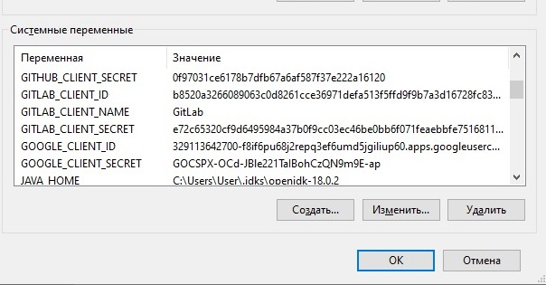
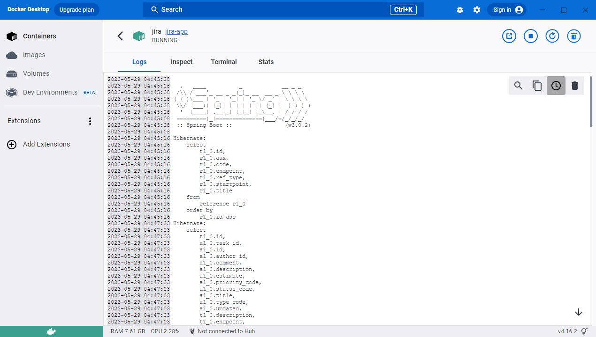
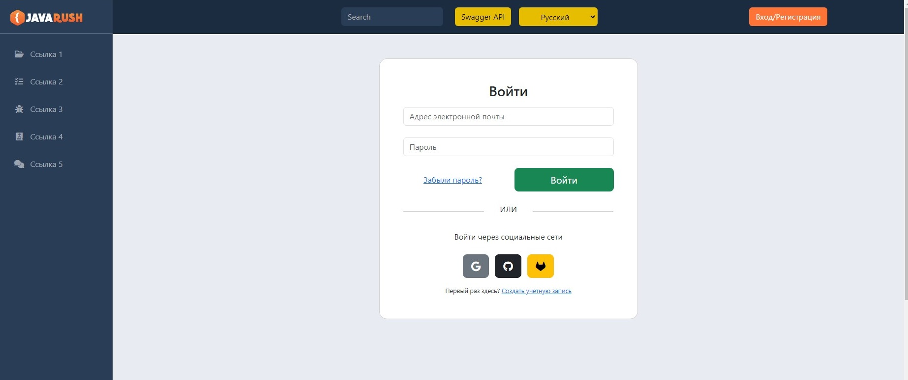

## [REST API](http://localhost:8080/doc)

```
  url: jdbc:postgresql://localhost:5432/jira
  username: jira
  password: JiraRush
```

<h2>List of completed tasks:</h2>

<p>&#10004;&#65039; 1. Understand the project structure (onboarding).</p>
<p>&#10004;&#65039; 2. Remove social networks: vk, yandex.</p>

<div align="center"><b>Before</b></div>
<br>

<div align="center"><b>After</b></div>
<br>
<p>&#10004;&#65039; 3. Transfer sensitive information (login, database password, identifiers for OAuth registration/authorization, mail settings) to a separate property file. The values of these properties must be read at server startup from the environment variables of the machine.</p>

<br>

<br>
<p>&#10004;&#65039; 4. Correct the tests so that during the tests the in memory database (H2) is used, and not PostgreSQL. To do this, you need to define 2 beans, and the selection of which one to use should be determined by the active Spring profile.</p>

<br>

<br>
<p>&#10004;&#65039; 5. Write tests for all public methods of the ProfileRestController controller.</p>

<br>
<p>&#10004;&#65039; 6. Add new functionality: adding tags to the task. The front is optional. (Without front)</p>

<br>
<p>&#10004;&#65039; 9. Write a Dockerfile for the main server.</p>
<p>&#10004;&#65039; 10. Write a docker-compose file to run the server container along with the database and nginx. For nginx, use the config/nginx.conf config file. If necessary, the config file can be edited.</p>
<p>&#10004;&#65039; In config/_application-prod.yaml correct <br>
<i>url: jdbc:postgresql://db:5432/jira</i></p>

<br>

<br>
<p>&#10004;&#65039; 11. Add localization in at least two languages for letter templates (mails) and index.html start page.</p>

<div align="center"><b>Before</b></div>
<br>

<div align="center"><b>After</b></div>
<br>

<div align="center"><b>After</b></div>
<br>

<div align="center"><b>After</b></div>

